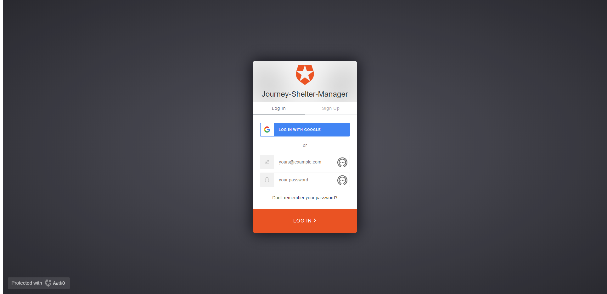

# JOURNEY'S SHELTER MANAGEMENT APPLICATION

### Overview:

Our intended application offers management for shelters via animal and donation
databases. Our product is valuable due to a strong and personable UI, and
donation management feature, which competitors do not have.

### User Stories:

As an intake person at a busy shelter, I want to be able to easily and efficiently input new animals into the system or update the system so that animal can be tracked through the intake process, and so, easily update the system when the animal gets adopted.

As a user I would be able to log in to the system, to see the shelter animals’ details


### Sign Up/Log In





### Technologies Used:
<ul>
<li>React</li>
<li>Mongoose</li>
<li>MongoDB</li>
<li>Express</li>
<li>AuthO</li>
<li>pdfkit npm package</li>
<li>React Bootstrap</li>
<li>Bootswatch</li>
</ul>

### Deployed at: 
[Journey App](https://journey-shelter-manager.herokuapp.com/)

### Team Member Roles:
<ul>
<li>Lynn - UI Master(Frontend)</li>
<li>Bindhu - Lead Frontend Designer</li>
<li>Sara - Director of Organization (Backend)</li>
<li>Zoe - Senior (Backend - Routes)</li>
<li>Sarah - Scrum Master/Project Manager (Backend - Front End if needed)</li>
<li>Ben - Master of All Trades (Frontend/Backend)</li>
</ul>

## About This Boilerplate

This setup allows for a Node/Express/React app which can be easily deployed to Heroku.

The front-end React app will auto-reload as it's updated via webpack dev server, and the backend Express app will auto-reload independently with nodemon.

## Starting the app locally

Start by installing front and backend dependencies. While in this directory, run the following command:

```
npm install
```

This should install node modules within the server and the client folder.

After both installations are complete, run the following command in your terminal:

```
npm start
```

Your app should now be running on <http://localhost:3000>. The Express server should intercept any AJAX requests from the client.